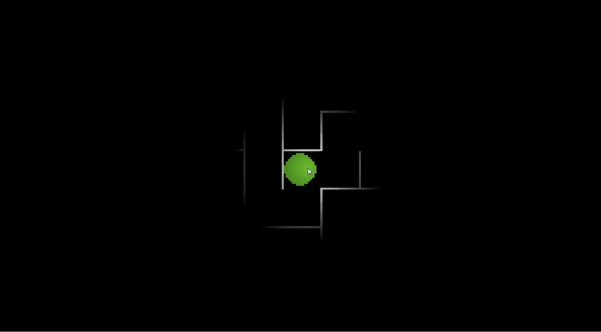

# Pac-Man Light Edition 

A pac-man clone game written in C where you navigate a maze while avoiding enemies. The twist? You can only see where your mouse pointer is.

Use the WASD keys to move. Avoid the red dot enemy until you've found the yellow power up. Once you're powered up, go straight for that sucker to win the game.

## Cool Technical Features
- This game is written in C using the Oogabooga engine for rendering. Everything else is hand written by me.
- Procedurally generated mazes using a depth first search maze generating algorithm
- Custom collision detection with AABB collisions
- Mouse controlled shaders using HLSL
- AI path finding

## Builds 
This project uses a C unity build with Clang to keep things simple. I prefer to leave that purple Windows IDE over at my day job.

### Quickstart
Currently, we only support Windows x64 systems.
1. Make sure Windows SDK is installed
1. Install clang, add to path
1. Clone repo to <project_dir>
1. Run `build.bat`
1. Run build/cgame.exe
1. profit
